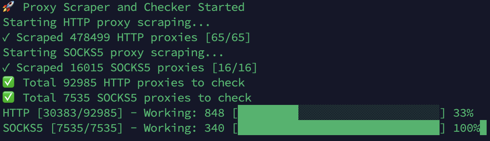

# Proxy Scrapper and Checker

A high-performance proxy scrapper and checker written in Go. This tool allows you to scrape proxies from various sources, check their validity, and maintain an up-to-date proxy list.



## Features

- Multi-source proxy scraping
- Concurrent proxy checking
- Support for HTTP and SOCKS5 proxies
- Configurable timeout and concurrency settings
- Progress tracking with real-time updates
- Automatic proxy format normalization
- Advanced proxy parsing from various unique list formats
- Automatic deduplication of proxies
- Integration with existing proxy lists in `/out` directory
- Real-time progress bar with working proxy count
- Strict checking mode for enhanced proxy validation
- Detailed output mode (requires strict mode) for comprehensive proxy analysis
- Docker support

## Prerequisites

### Manual Installation
- Go 1.24.1 or later
- Git

### Docker Installation
- Docker
- Docker Compose (optional)

## Installation

### Manual Installation

1. Install Go 1.24.1:
   - Windows:
     ```bash
     # Download Go 1.24.1 from https://golang.org/dl/
     # Run the installer
     # Verify installation
     go version
     ```
   - Linux:
     ```bash
     wget https://golang.org/dl/go1.24.1.linux-amd64.tar.gz
     sudo tar -C /usr/local -xzf go1.24.1.linux-amd64.tar.gz
     echo "export PATH=$PATH:/usr/local/go/bin" >> ~/.bashrc
     source ~/.bashrc
     go version
     ```
   - macOS:
     ```bash
     brew install go@1.24
     ```

2. Clone the repository:
   ```bash
   git clone https://github.com/Hiddence/ProxyScraperChecker.git
   cd ProxyScraperChecker
   ```

3. Build the project:
   ```bash
   go build -o proxy-scraper-checker
   ```

### Docker Installation

1. Clone the repository:
   ```bash
   git clone https://github.com/Hiddence/ProxyScraperChecker.git
   cd ProxyScraperChecker
   ```

2. Build and run using Docker:
   ```bash
   docker build -t proxy-scraper-checker .
   docker run -v $(pwd):/app proxy-scraper-checker
   ```

Or using Docker Compose:
   ```bash
   docker compose up
   ```

## Configuration

The project uses `config.yaml` for configuration and command line flags for additional options. Here's an explanation of all parameters:

```yaml
# Scraper configuration
scraper:
  timeout: 10s              # Request timeout for scraping
  user_agent: "Mozilla/5.0..."  # User-Agent string for requests
  concurrent: 10            # Number of concurrent scraping requests

# Checker configuration
checker:
  concurrent: 200          # Number of concurrent proxy checks
  check_urls:              # List of URLs to test proxies against
    - "http://checkip.amazonaws.com"
    - "http://google.com"
```

### Command Line Flags

The tool supports the following command line flags:

- `--strict` - Enable strict proxy checking (default: false)
- `--detailed` - Show detailed checking results (default: false, only works when `--strict` is enabled)

Example usage with flags:
```bash
# Run with strict checking
./proxy-scraper-checker --strict

# Run with detailed output (requires --strict)
./proxy-scraper-checker --strict --detailed

# Note: --detailed without --strict will be ignored
```

## Updating Proxy Sources

To update the proxy sources, edit the following files in the `/sources` directory:

- `/sources/http.txt` - for HTTP proxy source URLs
- `/sources/socks5.txt` - for SOCKS5 proxy source URLs

Each file should contain one URL per line. The tool will fetch proxies from these URLs and supports various proxy formats in the responses:

1. Plain text format (IP:PORT):
   ```
   1.2.3.4:8080
   5.6.7.8:3128
   ```

2. JSON format:
   ```json
   {
     "data": [
       {
         "ip": "1.2.3.4",
         "port": "8080"
       }
     ]
   }
   ```

3. URLs with protocol:
   ```
   http://1.2.3.4:8080
   socks5://5.6.7.8:1080
   ```

Example of source URLs in the files:
```
# /sources/http.txt
https://www.proxy-list.download/api/v1/get?type=http
https://raw.githubusercontent.com/ShiftyTR/Proxy-List/master/http.txt

# /sources/socks5.txt
https://www.proxy-list.download/api/v1/get?type=socks5
https://raw.githubusercontent.com/ShiftyTR/Proxy-List/master/socks5.txt
```

The tool will automatically normalize all proxy formats to IP:PORT format during processing.

## Usage

### Manual Usage

1. Configure your sources in `config.yaml`
2. Run the scanner:
   ```bash
   ./proxy-scraper-checker
   ```

### Docker Usage

1. Configure your sources in `config.yaml`
2. Run using Docker:
   ```bash
   docker run -v $(pwd):/app proxy-scraper-checker
   ```

Or using Docker Compose:
   ```bash
   docker compose up
   ```

## Output

The tool will display real-time progress of proxy scraping and checking. When running with command line flags, it will show active parameters at startup:

```
🚀 Proxy Scraper and Checker Started
Active parameters:
  • Strict checking mode enabled
  • Detailed output mode enabled

Starting HTTP proxy scraping...
✓ Scraped 477500 HTTP proxies [65/65]
Starting SOCKS5 proxy scraping...
✓ Scraped 16088 SOCKS5 proxies [16/16]
ℹ️ Found 202 existing HTTP proxies
ℹ️ Found 135 existing SOCKS5 proxies
✅ Total 93981 HTTP proxies to check
✅ Total 7249 SOCKS5 proxies to check
HTTP [83120/93981] - Working: 1394 [██████████████████████████░░░░] 88%
SOCKS5 [7249/7249] - Working: 608 [██████████████████████████████] 100%
```

The output shows:
- Active command line parameters (if any)
- Number of proxies scraped from each source
- Number of existing proxies found in `/out` directory
- Total number of unique proxies to check (after deduplication)
- Real-time progress of proxy checking with working proxy count
- Visual progress bar showing completion percentage

Note: The `/out/http.txt` and `/out/socks5.txt` files are automatically overwritten with new results each time the tool is run.

## License

This project is licensed under the MIT License - see the [LICENSE](LICENSE) file for details.

## Acknowledgments

- Thanks to all proxy list providers
- Inspired by various proxy checking tools

---

<div align="center">
  <a href="https://hiddence.net">
    
  </a>
  <br>
  <a href="https://hiddence.net">Anonymous hosting provider for your needs</a>
</div>
